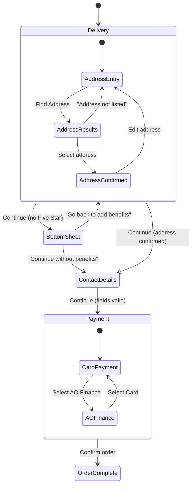

# Design Document: Checkout Flow Prototype

## Overview

This design describes a single self-contained HTML prototype implementing a three-step checkout flow (Delivery → Contact Details → Payment) for the AO e-commerce design system. The prototype is a functional interactive page that demonstrates working step navigation, address lookup progressive disclosure, form validation, payment method switching, a Five Star upsell bottom sheet modal, and an order summary sidebar — all built with AO design tokens, typography, and component blueprints.

The output is a single `.html` file with inline `<style>` and `<script>` blocks. It loads only permitted external resources (Google Fonts, Strata icons CSS, AO SmileyFace font files). It runs directly from the filesystem with no build step.

### Key Design Decisions

1. **Single-file architecture** — All CSS and JS inline. No modules, no bundler, no framework. Vanilla JS manages state via a plain object and DOM manipulation.
2. **State machine approach** — A simple state object tracks the current step, address lookup phase, Five Star selection, and form data. Step transitions are guarded by validation functions.
3. **Progressive disclosure** — The address lookup flow and payment method switching reveal content in sequence rather than showing everything at once.
4. **Mobile-first responsive** — Base styles target narrow viewports; `min-width` media queries add the two-column sidebar layout at 900px.
5. **AO design system compliance** — Every colour, radius, shadow, and spacing value references a CSS custom property from the `:root` token block. Components use the exact class names and `data-aods` attributes from `kit/components.md`.

---

## Architecture

### Single-File Structure

```
checkout-flow-prototype.html
├── <!DOCTYPE html> + <html lang="en">
├── <head>
│   ├── Meta (charset, viewport)
│   ├── External links (Google Fonts, Strata icons, SmileyFace fonts)
│   └── <style> (all CSS inline)
│       ├── :root token block (from kit/tokens.md)
│       ├── @font-face declarations
│       ├── Reset + base styles
│       ├── Typography utility classes
│       ├── Component styles (btn, field, toggle, card, notice, tag, nav, footer)
│       ├── Layout styles (checkout grid, step navigator, sidebar)
│       ├── Step-specific styles (delivery, contact, payment)
│       ├── Bottom sheet modal styles
│       └── Responsive breakpoints (@media queries)
├── <body>
│   ├── <header> — Checkout nav (logo + help + basket)
│   ├── <div class="steps"> — Step navigator (pills)
│   ├── <main> — Checkout grid
│   │   ├── <div class="checkout-main"> — Step panels (only one visible)
│   │   │   ├── Step 1: Delivery
│   │   │   ├── Step 2: Contact Details
│   │   │   └── Step 3: Payment
│   │   └── <aside> — Order Summary Sidebar
│   ├── <div class="bottom-sheet-scrim"> — Modal overlay
│   ├── <div class="bottom-sheet"> — Five Star upsell modal
│   └── <footer> — Legal + links
└── <script> (all JS inline)
    ├── State management object
    ├── Step navigation controller
    ├── Address lookup flow controller
    ├── Form validation functions
    ├── Payment method switcher
    ├── Order summary calculator
    ├── Bottom sheet modal controller
    └── Event binding + initialisation
```

### State Management



The application state is held in a single JavaScript object:

```javascript
const state = {
  currentStep: 0,              // 0=Delivery, 1=Contact, 2=Payment
  stepsCompleted: [false, false, false],
  addressPhase: 'entry',       // 'entry' | 'results' | 'confirmed'
  addressData: { houseNumber: '', postcode: '', selectedAddress: null },
  deliveryDate: '',
  deliveryTime: '',
  fiveStarSelected: false,
  contactData: { email: '', title: '', firstName: '', lastName: '', mobile: '', altNumber: '' },
  paymentMethod: 'card',       // 'card' | 'finance'
  financeOption: '4.9-interest',
  billingMatchesDelivery: true,
  termsAccepted: false,
  bottomSheetOpen: false
};
```

---

## Components and Interfaces

### Step Navigator

- Three pill-style tabs: Delivery / Contact / Payment
- Uses `role="tablist"` with `role="tab"` on each pill and `aria-selected` attributes
- Active step: navy background (`--type-primary`), white text
- Completed step: checkmark icon, blue text (`--action-secondary-base`)
- Unreached step: muted text (`--type-tertiary`), `cursor: not-allowed`, no click handler
- On mobile (< 544px): labels collapse, only active step shows its label

### Address Lookup Flow (Delivery Step)

Three progressive disclosure phases:

1. **Entry phase** — House number (optional) + postcode (required) + "Find Address" button
2. **Results phase** — Select dropdown with 3+ simulated addresses + "My address isn't listed" link
3. **Confirmed phase** — Address summary card + "Edit address" link

Transitions animate with `max-height` and `opacity` over 300ms `ease-out`.

### Delivery Options

- Shown only after address is confirmed
- Date picker: `<select>` with 3+ dates (e.g. "Thursday 22 May", "Friday 23 May", "Saturday 24 May")
- Time picker: `<select>` with 3+ windows (e.g. "Any time (7am–7pm)", "Morning (7am–12pm)", "Afternoon (12pm–5pm)")
- Confirmation text below selects
- "Continue" button: `btn-primary btn-full`

### Five Star Upsell Card

- Card with green checkmark benefits list (3 items)
- Pricing: "£39.99/yr"
- Checkbox toggle (unchecked default) — selecting updates the order summary total
- "Learn more" link opens in new tab (`target="_blank" rel="noopener"`)

### Contact Details Form

- Fields: email, title (select), first name, last name, mobile, alternative number
- All required except none — all are required per requirements
- Validation: email format, UK phone format (11 digits, 07 prefix for mobile)
- Info notice below alt number explaining backup contact purpose
- Security notice with privacy policy link

### Payment Method Selection

- Radio toggle group: "Card payment" (with card logos) vs "AO Finance" (with tag)
- Card form: name on card, card number (19 max, numeric), expiry month/year dropdowns, security code (4 max, numeric)
- Finance sub-options: 3 radio items with descriptions + eligibility notice
- Billing address toggle: "Same as delivery?" Yes/No — "No" reveals address form
- Terms checkbox + "Confirm order and pay" CTA

### Order Summary Sidebar

- Sticky at `top: 80px` on desktop (≥ 900px)
- Product card: image placeholder, name, price, stock status tag
- Line items: subtotal, delivery (TBC → actual after address), Five Star (conditional), total
- Uses `font-variant-numeric: tabular-nums` for price alignment
- Recalculates dynamically when Five Star is toggled or delivery is confirmed

### Bottom Sheet Modal

- Triggered when advancing from Delivery without Five Star selected
- Slides up from bottom (300ms `ease-out`), scrim overlay (`rgba(1,22,48,0.5)`)
- Focus trapped within modal (Tab/Shift+Tab cycle)
- Two actions: "Go back to add my benefits" (primary) + "Continue without using my benefits" (link)
- Escape key = "Go back"
- On close: restores focus to triggering element

---

## Data Models

### Simulated Address Data

```javascript
const MOCK_ADDRESSES = [
  { line1: '14 Maple Close', city: 'Manchester', postcode: 'M14 5RQ' },
  { line1: '16 Maple Close', city: 'Manchester', postcode: 'M14 5RQ' },
  { line1: '18 Maple Close', city: 'Manchester', postcode: 'M14 5RQ' },
  { line1: '20 Maple Close', city: 'Manchester', postcode: 'M14 5RQ' }
];
```

### Product Data

```javascript
const ORDER_DATA = {
  product: {
    name: 'Samsung 65" QE65Q80C QLED 4K Smart TV',
    sku: 'QE65Q80C',
    price: 999.00,
    image: '📺',  // Emoji placeholder
    inStock: true
  },
  delivery: {
    cost: 0,       // Free delivery (updated after address confirm)
    confirmed: false
  },
  fiveStar: {
    price: 39.99,
    selected: false
  }
};
```

### Delivery Options Data

```javascript
const DELIVERY_DATES = [
  { value: 'thu-22-may', label: 'Thursday 22 May' },
  { value: 'fri-23-may', label: 'Friday 23 May' },
  { value: 'sat-24-may', label: 'Saturday 24 May' }
];

const DELIVERY_TIMES = [
  { value: 'anytime', label: 'Any time (7am–7pm)' },
  { value: 'morning', label: 'Morning (7am–12pm)' },
  { value: 'afternoon', label: 'Afternoon (12pm–5pm)' }
];
```

### Validation Rules

| Field | Rule | Error message |
|-------|------|--------------|
| Postcode | Non-empty, max 8 chars | "Enter your postcode to find your address" |
| Email | Contains `@` and `.` after `@` | "Enter a valid email address, like name@example.com" |
| First name | Non-empty, max 50 chars | "Enter your first name" |
| Last name | Non-empty, max 50 chars | "Enter your last name" |
| Mobile | 11 digits, starts with `07` | "Enter a valid UK mobile number (11 digits starting 07)" |
| Alt number | 11 digits, starts with `0` | "Enter a valid UK phone number (11 digits starting with 0)" |
| Card number | 13–19 digits | "Enter a valid card number" |
| Expiry | Month + Year selected | "Select your card's expiry date" |
| Security code | 3–4 digits | "Enter the 3 or 4 digit security code" |
| Name on card | Non-empty, max 100 chars | "Enter the name on your card" |
| Terms checkbox | Checked | "You must accept the terms and conditions to continue" |

---


## Correctness Properties

*A property is a characteristic or behavior that should hold true across all valid executions of a system — essentially, a formal statement about what the system should do. Properties serve as the bridge between human-readable specifications and machine-verifiable correctness guarantees.*

### Property 1: Step navigation invariant

*For any* step activation (via click, submission, or programmatic navigation), exactly one step panel SHALL be visible, exactly one tab SHALL have `aria-selected="true"`, the active tab SHALL have the active visual styling, and all unreached tabs SHALL not respond to click events.

**Validates: Requirements 2.2, 2.5, 2.6, 14.1**

### Property 2: Step completion and forward progression

*For any* step with all guard conditions satisfied (Delivery: address confirmed + date selected; Contact: all fields valid; Payment: terms accepted), submitting that step SHALL mark it as completed, advance to the next step, and preserve all previously entered data. Conversely, for any step with unsatisfied guard conditions, submitting SHALL not advance.

**Validates: Requirements 2.7, 5.5, 5.6, 7.5**

### Property 3: Address lookup state machine

*For any* postcode input value, clicking "Find Address" SHALL transition to the results phase if and only if the postcode is non-empty. For any address selection from results, confirming SHALL transition to the confirmed phase displaying that address. For any confirmed state, editing SHALL return to the entry phase with previously entered values preserved. At all times, exactly one address lookup phase SHALL be visible.

**Validates: Requirements 4.2, 4.3, 4.5, 4.6, 14.2**

### Property 4: Order total calculation

*For any* combination of product price, delivery cost, and Five Star membership selection, the displayed grand total SHALL equal the sum of (product price + delivery cost + (Five Star price if selected)). When Five Star is toggled on, the total SHALL increase by exactly £39.99; when toggled off, it SHALL decrease by exactly £39.99. When a delivery address is confirmed, the delivery cost SHALL update from "TBC" to the numeric value.

**Validates: Requirements 6.4, 6.5, 10.2, 10.3, 10.5, 10.6**

### Property 5: Form validation with ARIA error states

*For any* form field that fails validation (empty required field, invalid email format, invalid UK phone format), the field SHALL display the error visual state (`is-error` class), set `aria-invalid="true"`, and link to an error message element via `aria-describedby`. *For any* valid input combination, no error states SHALL be displayed.

**Validates: Requirements 7.6, 7.7, 7.8, 15.4**

### Property 6: Payment method mutual exclusion

*For any* payment method selection (Card or AO Finance), exactly one payment content section SHALL be visible at a time. The previously visible section SHALL be hidden and the newly selected section SHALL be shown.

**Validates: Requirements 8.4, 14.3**

### Property 7: Bottom sheet focus trap

*For any* sequence of Tab or Shift+Tab key presses while the Bottom_Sheet_Modal is open, keyboard focus SHALL cycle only among the focusable elements within the modal and SHALL not escape to elements outside the modal. The modal SHALL open when advancing from Delivery without Five Star selected.

**Validates: Requirements 11.1, 11.2, 15.6**

### Property 8: Terms acceptance guard

*For any* form state on the Payment step where the terms checkbox is unchecked, activating "Confirm order and pay" SHALL display an error message and SHALL NOT submit the form or advance the flow.

**Validates: Requirements 9.5**

### Property 9: Design token compliance

*For any* CSS declaration outside the `:root` block that sets a colour, box-shadow, or border-radius value, the value SHALL reference a CSS custom property via `var()` rather than a raw hex or pixel literal.

**Validates: Requirements 12.1**

### Property 10: Label and ARIA association

*For any* form input element in the prototype, there SHALL exist a visible `<label>` element with a `for` attribute matching the input's `id`. *For any* decorative icon, `aria-hidden="true"` SHALL be present. *For any* icon-only interactive element, an `aria-label` SHALL be provided.

**Validates: Requirements 15.3, 15.8**

### Property 11: Non-color state indication

*For any* state change (error, success, active step, completed step), the state SHALL be conveyed through at least one additional non-color cue (icon, text label, font-weight change, or border-style change) alongside the colour change.

**Validates: Requirements 15.10**

---

## Error Handling

### Form Validation Errors

| Scenario | Behaviour |
|----------|-----------|
| Empty required field on submit | Show red border (`is-error`), red helper text below field, `aria-invalid="true"` |
| Invalid email format | Inline error: "Enter a valid email address, like name@example.com" |
| Invalid UK phone number | Inline error: "Enter a valid UK mobile number (11 digits starting 07)" |
| Empty postcode on Find Address | Error state on postcode field + "Enter your postcode to find your address" |
| Terms not accepted on payment | Error message below checkbox, form does not submit |

### Error State Visual Pattern

Following the AO field component pattern:
- Input border: `var(--ui-error-accent)` (#b50016)
- Input background: `var(--ui-error-base)` (#fff0f6)
- Message text: `var(--ui-error-contrast)` (#b50016)
- Message format: starts with a verb, describes the fix

### Error Clearing

- Errors clear on the next valid input or blur event (not on keystroke, to avoid flicker)
- When a field transitions from error to valid, remove `is-error` class, `aria-invalid`, and the error message
- On step re-entry (navigating back), preserve any previously valid data but clear error states

### Edge Cases

| Case | Handling |
|------|----------|
| User navigates back to Delivery after completing Payment | All entered data preserved, step state remains completed |
| Five Star toggled rapidly | Debounced — total recalculates once after 150ms of inactivity |
| Bottom sheet opened on extremely narrow viewport | Sheet takes full viewport width, maintains internal scroll |
| User submits with multiple empty fields | All invalid fields highlighted simultaneously, focus moved to first error |

---

## Testing Strategy

### Unit Tests (Example-Based)

Unit tests verify specific structural and interaction scenarios:

- **Structural tests**: Verify the HTML contains required elements (header, footer, form fields, ARIA attributes, semantic elements)
- **Initial state tests**: Step 1 active, Five Star unchecked, Card payment selected, address in entry phase
- **Responsive layout tests**: Two-column at 900px+, single-column below
- **Specific interactions**: Bottom sheet Escape key, "My address isn't listed" link, billing address toggle

### Property-Based Tests

Property-based tests verify universal properties across generated inputs. These use the `fast-check` library (JavaScript) with a minimum of 100 iterations per property.

**Target functions for PBT:**

1. **`validateEmail(input)`** — Property 5: For any string, returns valid iff contains `@` and domain
2. **`validatePhone(input, type)`** — Property 5: For any string, returns valid iff matches UK phone pattern
3. **`calculateTotal(subtotal, deliveryCost, fiveStarSelected)`** — Property 4: Sum is always correct
4. **`getStepState(currentStep, completedSteps)`** — Properties 1-2: Exactly one active, unreached disabled
5. **`getAddressPhase(actions)`** — Property 3: State machine produces valid phase transitions
6. **`getVisiblePaymentSection(selectedMethod)`** — Property 6: Exactly one section visible
7. **`trapFocus(focusableElements, currentIndex, direction)`** — Property 7: Focus cycles within bounds

**Configuration:**
- Library: `fast-check` (npm)
- Iterations: 100 minimum per property
- Tag format: `Feature: checkout-flow-prototype, Property {N}: {title}`

### Integration Tests

- Full flow walkthrough: Delivery → Contact → Payment with valid data
- Bottom sheet trigger and both resolution paths
- Five Star toggle with order total verification
- Address lookup full cycle (entry → results → confirmed → edit → re-confirm)

### Accessibility Tests

- axe-core automated scan of rendered HTML
- Keyboard navigation walkthrough (Tab order matches visual order)
- Screen reader announcement verification for dynamic content changes

